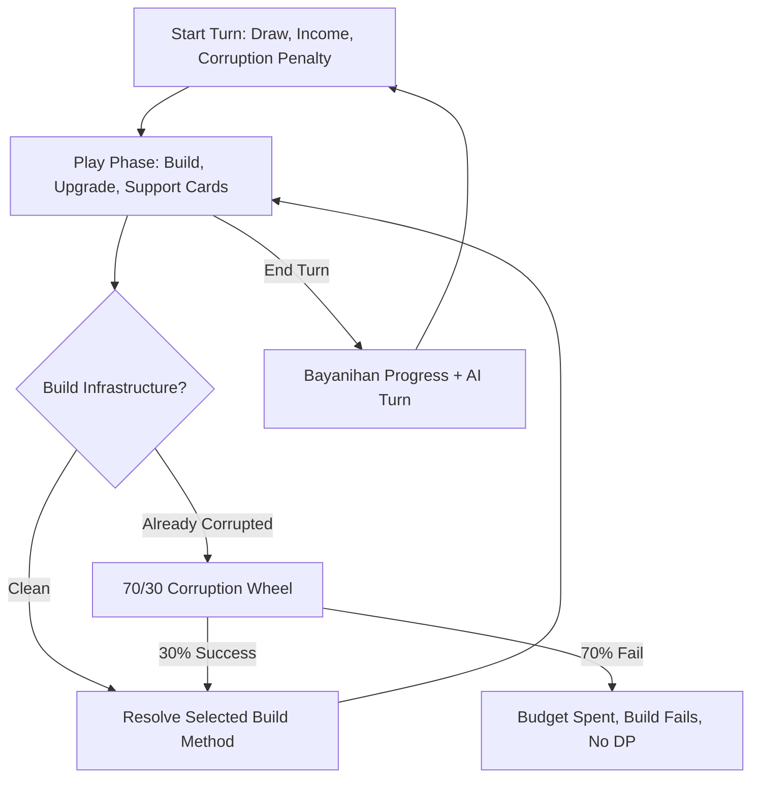

# State of Affairs — Complete Game Flow & Mechanics Guide

**State of Affairs** is a turn-based political ethics strategy card game. The player and an AI opponent compete to build public infrastructure, manage Budget, preserve Public Trust, and decide whether short-term development gains are worth the ethical and systemic risk of corruption.

---

## 1. Core State & HUD Resources

Each side internally tracks these resources:

* **Development Points (DP):** The primary victory condition. The first side to reach **4 DP** wins.
* **Public Trust (Max 5):** If the player's Public Trust reaches **0**, the player loses by impeachment. If the AI's Trust reaches **0**, the player wins.
* **Budget:** Currency used to build and upgrade infrastructure. Each turn gives baseline income of **+3 Budget**.
* **Corruption Status:** A player is either **Clean** or **Corrupted**. There are no corruption levels, tokens, collapse timers, or guessing systems.
* **Agenda Slots (3 Slots):** The active zone where infrastructure projects are placed, built, and upgraded.

The player can see their own Budget, Trust, DP, and Clean/Corrupted status. The opponent's visible information is limited to **Development Points** unless a card effect reveals more.

---

## 2. Turn Flow

### Phase 1: Start Turn

At the start of the player's turn:

1. **Draw Cards**
   * Turn 1: player and AI each draw **6 cards**.
   * Later turns: the active side draws **1 card**.
2. **Income**
   * Player gains **+3 Budget**.
3. **Corruption Penalty**
   * If the player is **Corrupted**, they lose **-1 Public Trust** and **-1 Budget**.
   * Budget and Trust cannot drop below 0.
4. **Reset Turn Feedback**
   * Temporary result popups and turn support logs are cleared.

### Phase 2: Play Phase

During the play phase, the player may:

* Drag Support Cards onto the board to activate them.
* Drag Infrastructure Cards from hand onto an empty Agenda Slot to open the procurement choice modal.
* Click built Infrastructure to upgrade it if they can pay the upgrade cost.
* End the turn.

---

## 3. Procurement Decision

When building infrastructure, the only available build methods are:

| Build Method | Budget Cost | DP Reward | Consequence |
| :--- | :--- | :--- | :--- |
| **Honest Build** | 3 Budget, minus active honest discounts | +1 DP immediately | Safe and stable. Eligible for passive support bonuses. |
| **Cut Corners** | 1 Budget | +1 DP immediately | The builder becomes **Corrupted**. |
| **Bayanihan** | 0 Budget | +1 DP after 3 turns | Community build. Takes 3 turns to complete. |

**Phased Build / Loan Build is removed.** There are no downpayments, interest, installments, or loan payoff steps.

---

## 4. Corruption Status System

Corruption is tracked as a simple status:

* **Clean**
* **Corrupted**

Choosing **Cut Corners** marks the builder as **Corrupted**.

While Corrupted, a player loses:

* **-1 Public Trust every turn**
* **-1 Budget every turn**

If a Corrupted player attempts another infrastructure build, a wheel/spinner resolves before the build succeeds:

* **70% chance: BUILD FAILS**
  * The infrastructure is not completed.
  * The card is consumed.
  * The paid Budget cost is consumed.
  * No DP is gained.
* **30% chance: BUILD SUCCEEDS**
  * The selected build method resolves normally.
  * Honest Build gives +1 DP.
  * Cut Corners gives +1 DP and the player remains Corrupted.
  * Bayanihan begins its normal 3-turn construction.

There are no corruption tokens, corruption levels, collapse timers, or corruption guessing mechanics.

---

## 5. Support Cards

Useful support cards remain, except cards tied only to the removed audit/guessing system.

Current regular support card pool:

* **Grassroots Initiative:** Free. The next Honest Build costs -1 Budget.
* **Human Capital Investment:** Costs 2 Budget. Passive: honest Public Hospital and Public School builds give +1 additional DP.
* **Green Subsidy:** Costs 2 Budget. Passive: honest Power Grid, Water Facility, and Transit System builds give +1 additional DP.
* **Economic Boom:** Free. Gain +2 Budget.

### Investigation

* Type: Special / Support Card
* Limit: Can appear up to **3 times per game** per side.
* Effect:
  * Reveals whether the opponent is currently Corrupted.
  * If the opponent is Corrupted:
    * Opponent loses **-2 Public Trust**.
    * Player gains **+3 Budget**.
  * If the opponent is Clean:
    * No penalty and no reward.

### AUTO CLEAN

* Type: Special / Support Card
* Limit: Can appear **1 time per game** per side.
* Effect:
  * Removes the user's Corrupted status.
  * The user becomes Clean.
  * The corruption turn penalty stops.

---

## 6. Weighted Card Drawing

Cards are drawn using weighted categories:

* **30%** Infrastructure Card
* **30%** regular Support Card
* **20%** AUTO CLEAN
* **20%** Investigation

Limits:

* AUTO CLEAN can only appear once per game per side.
* Investigation can only appear three times per game per side.
* Once a limited category is exhausted, its weight is redistributed among currently valid categories.

Infrastructure card pool:

* Public Hospital
* Transit System
* Public School
* Power Grid
* Water Facility

---

## 7. AI Behavior

The AI follows the same rules internally:

* AI cannot use Loan / Phased Build.
* AI can choose Honest Build, Cut Corners, or Bayanihan.
* If the AI is already Corrupted and attempts to build, the same 70% fail / 30% success corruption wheel is applied internally.
* AI loses -1 Trust and -1 Budget each turn while Corrupted.
* AI may use AUTO CLEAN if it has the card and is Corrupted.
* AI may use Investigation internally if it has the card.
* AI Trust, Budget, hand, and Corruption Status remain hidden from the player unless a card effect reveals relevant information.

---

## 8. UI Requirements

The UI must show:

* Player status: **Clean** or **Corrupted**.
* Opponent visible info: **Development Points only**.
* Build/action options: **Honest Build**, **Cut Corners**, and **Bayanihan** only.
* Corruption wheel modal when a Corrupted player attempts to build.
* Investigation result modal:
  * "Opponent is Corrupted" or "Opponent is Clean"
  * Shows reward and penalty if the opponent was Corrupted.
* AUTO CLEAN feedback:
  * "Corruption removed. You are now Clean."

The UI must not expose:

* Loan / Phased Build
* Audit guessing
* Old audit modal
* Old purify mechanic
* Corruption tokens, corruption levels, or collapse timers

---

## 9. Win & Loss Conditions

The game ends immediately when:

* **Victory:** Player reaches **4 DP**.
* **Victory:** AI Public Trust reaches **0**.
* **Victory by Term Limit:** Deck ends and the Player has at least as much DP as the AI.
* **Defeat by Impeachment:** Player Public Trust reaches **0**.
* **Defeat:** AI reaches **4 DP**.
* **Defeat by Term Limit:** Deck ends and the AI has more DP than the Player.

---

## 10. Balance Goal

The intended feel:

* Honest Build is safe and stable.
* Cut Corners gives faster DP but creates long-term pressure.
* Being Corrupted is dangerous because every future build risks a 70% failure.
* AUTO CLEAN is a rare recovery tool.
* Investigation is the main way to punish a Corrupted opponent.
